# Budget
by [__Zube Pierre Basali__](https://zubepb.github.io/) for [__The C# Academy__](https://thecsharpacademy.com/)

## Introduction
This application is made to manage finances following these requirements:
- This is an application where you should record personal finance transactions.
- You should have at least two linked tables: Transaction and Category.
- You need to use Entity Framework, raw SQL isn't allowed.
- Each transaction MUST have a category and if you delete a category all it's transactions should be deleted.
- You should use SQL Server, not SQLite.
- You should have a search functionality where I can search transactions by name
- You should have a filter functionality, so I can show transactions per category and per date.
- You need to use modals to insert, delete and update transactions and categories. These operations shouldn't be done in a different page.

## Structure
The application contains two side: the server and th UI.

The server is hosting an SQL database using Entity Framework. 
The UI is handled using html,css and javascript.

### The server
The server consists of two distinct database for Personal/Business transactions using Entity Framework. 
The Personal Transactions part of the app contains the strict necessary to fit the requirements. 
The Business Transactions part contains additional functions and fields. 
There is some code to seed data for testing purpose if necessary.(See the comments in the contexts)

### The UI
The data are fetched from the MVC server then displayed/handled using javascript.
#### Personal Transactions Part

##### Transactions
The data is presented in a table with pagination. 
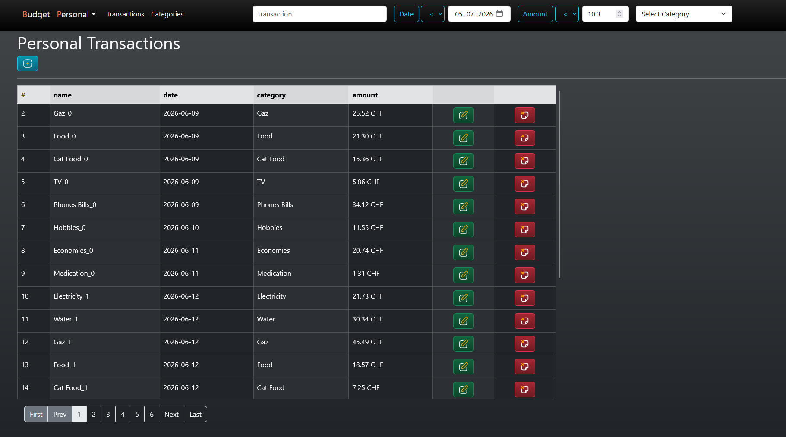

Every input while searching updates the displayed data. 
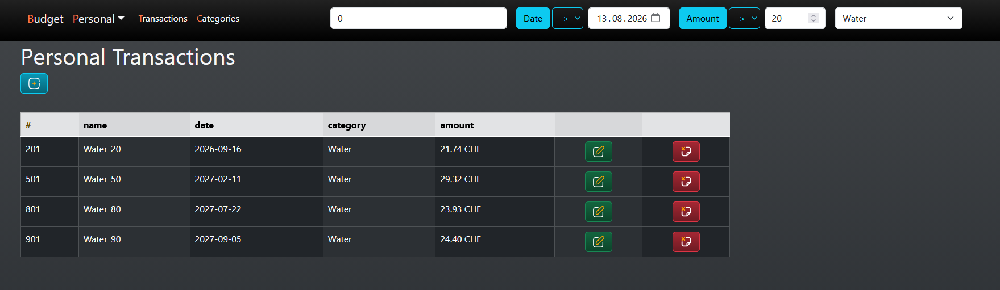

Every data operation is handled in a modal. 
Add:
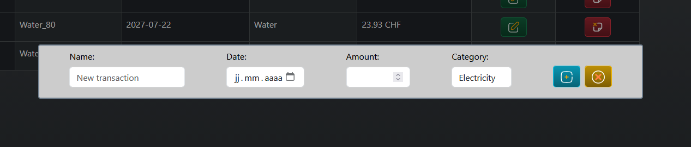

Edit:
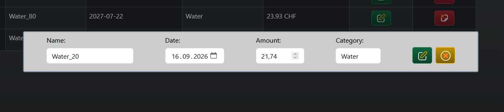

Delete:
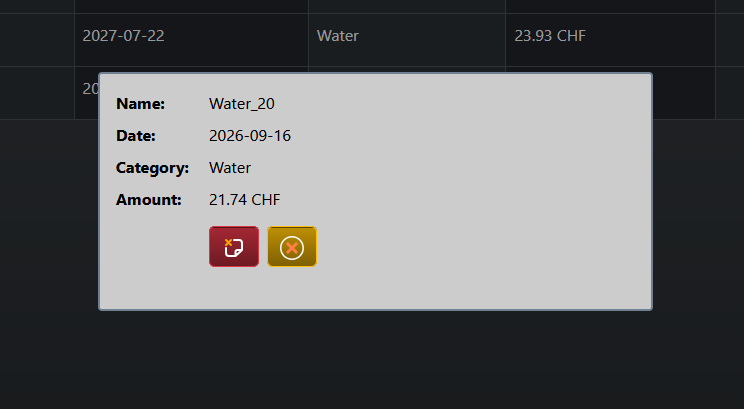

##### Categories
The data is presented in a table. 
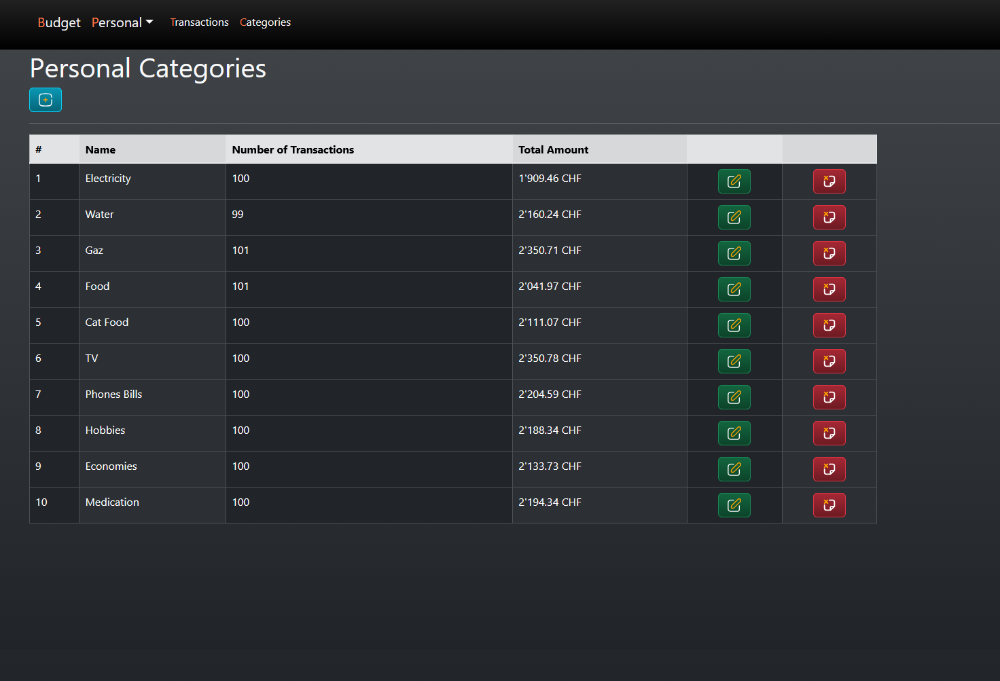

Everything function the same here. 
Deleting a category deletes all transaction related to it.
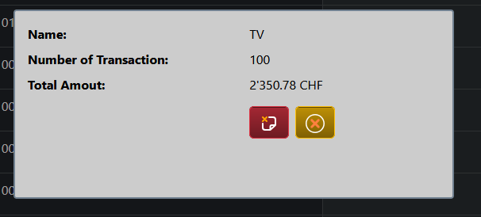
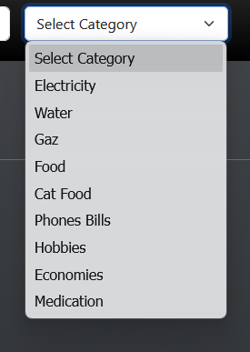

#### Business Transaction
The structure follows personal transactions' structure, only a supplier field is added. 
Upon supplier deletion, all data related to it is deleted. 
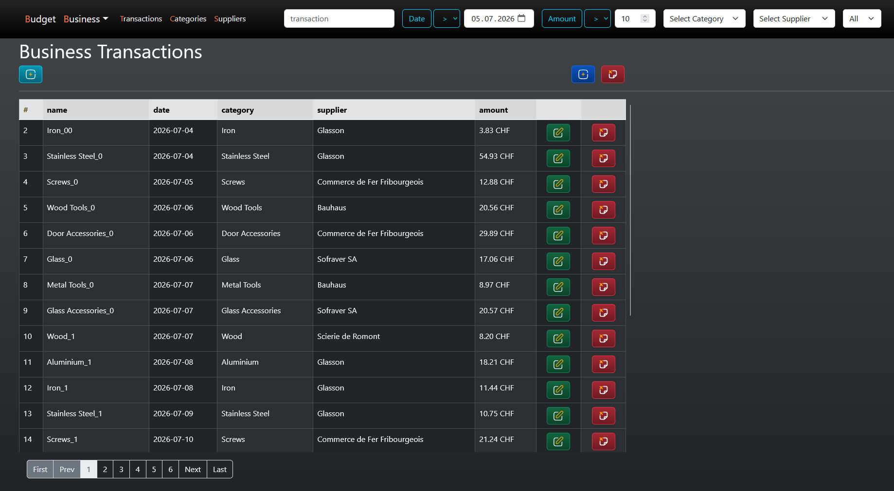

Automatic/recurrent transactions can be added. 

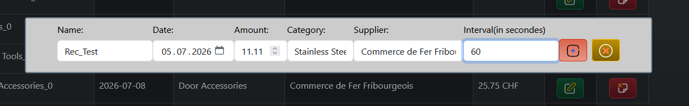
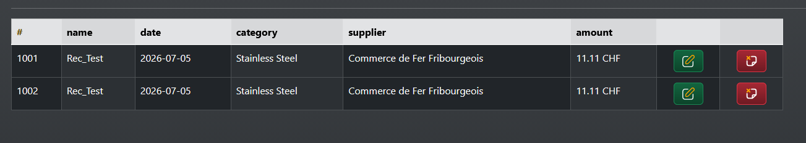

The process can also be stopped. The previously added transactions are not deleted. 

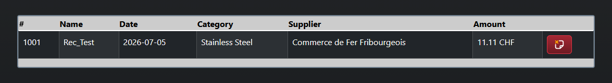
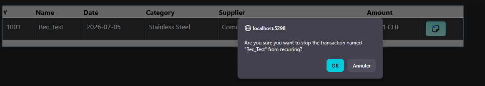

## Resources
- The C# Academy, Budget: [link](https://thecsharpacademy.com/project/27/budget)
- StackOverflow: [link](https://stackoverflow.com/questions)
- Bootstrap: [link](https://getbootstrap.com/)
- SVG Repo, Free SVG Vectors and Icons: [link](https://www.svgrepo.com/)